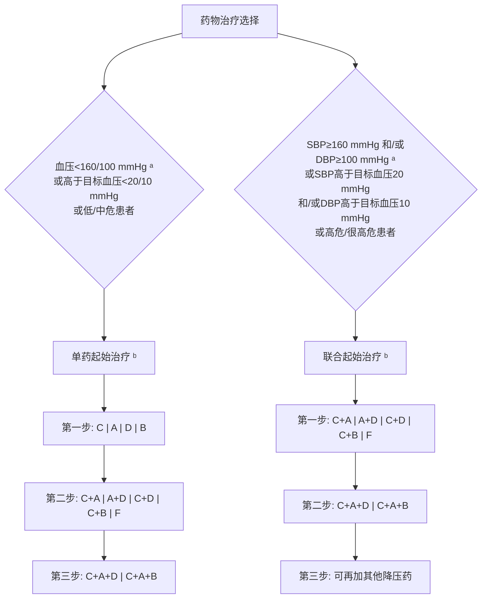
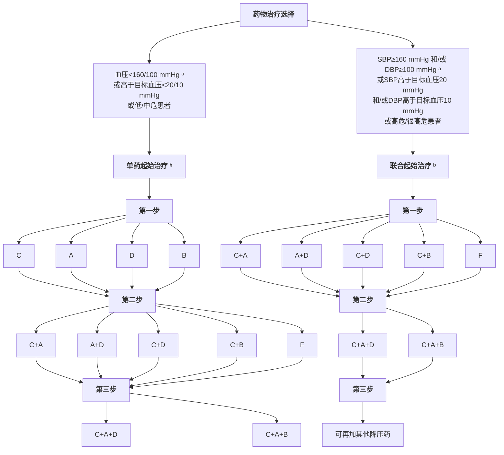

# 高血压患者单药或联合治疗方案（简化版）

---

## 详细版本（带独立药物框）

---

## 注释说明

| 缩写 | 全称 |
|------|------|
| **SBP** | 收缩压 |
| **DBP** | 舒张压 |
| **C** | 钙通道阻滞剂（二氢吡啶类） |
| **A** | 血管紧张素转换酶抑制剂或血管紧张素Ⅱ受体拮抗剂 |
| **D** | 噻嗪类利尿剂 |
| **B** | β受体阻滞剂 |
| **F** | 固定复方制剂 |

### 备注
- ᵃ 对血压≥140/90 mmHg的高血压患者，也可起始联合治疗
- ᵇ 包括剂量递增到足剂量
- 1 mmHg = 0.133 kPa

---
**图2 高血压患者单药或联合治疗方案**
